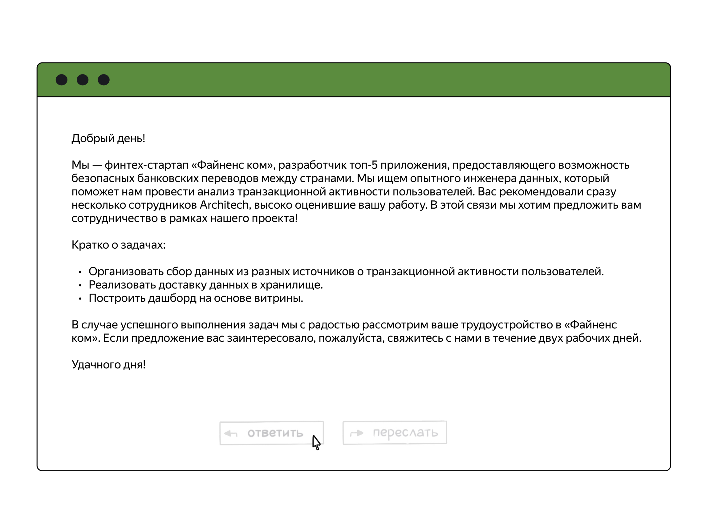
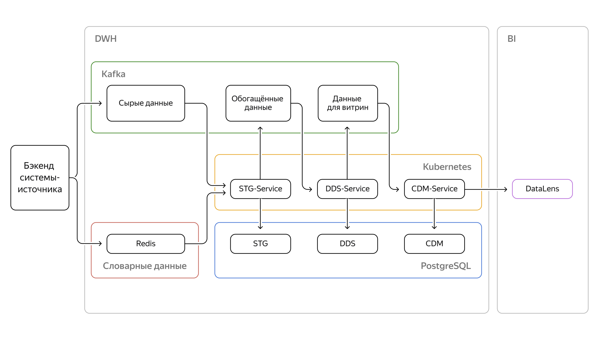

# Проект 9-го спринта

### Описание
Репозиторий предназначен для сдачи проекта 9-го спринта по облачным технологиям (с использованием сервисов Yandex Cloud).

### Структура репозитория
- `pics` - здесь лежит единственная фотография для ридми.
- `ddl` - здесь DDL всех таблиц слоёв данных PostgreSQL.
- `documentation` - описание команд, сопровождающих функциональность Kafka и Redis.
- `solution` - здесь реализация полной архитектуры решения. 

## Задача
### Описание задачи

В этом проекте вам нужно реализовать два оставшихся сервиса (первый был реализован в ходе выполнения практических заданий 9 спринта), которые заполняют слои DDS и CDM, и визуализировать данные из витрины в дашборде.

Полная архитектура решения выглядит так:

